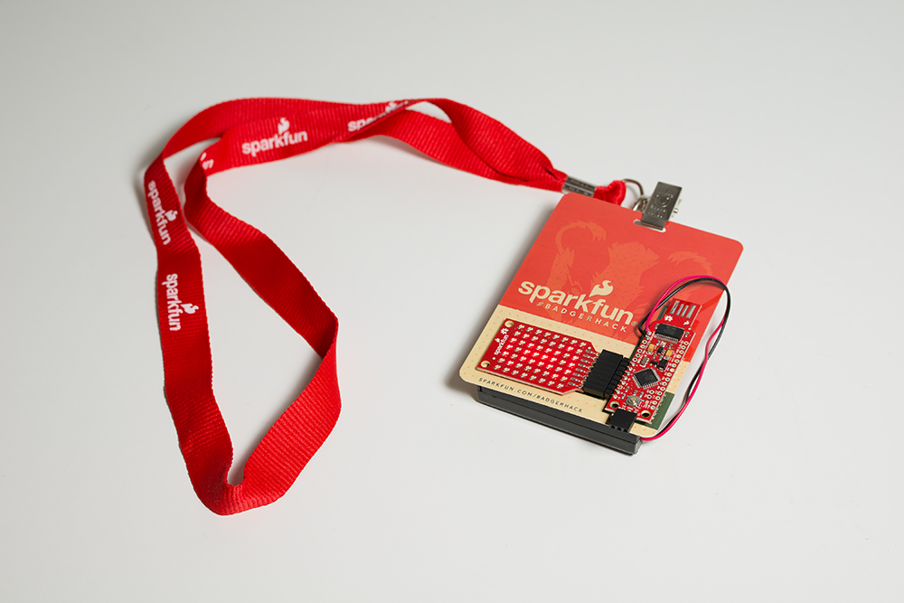
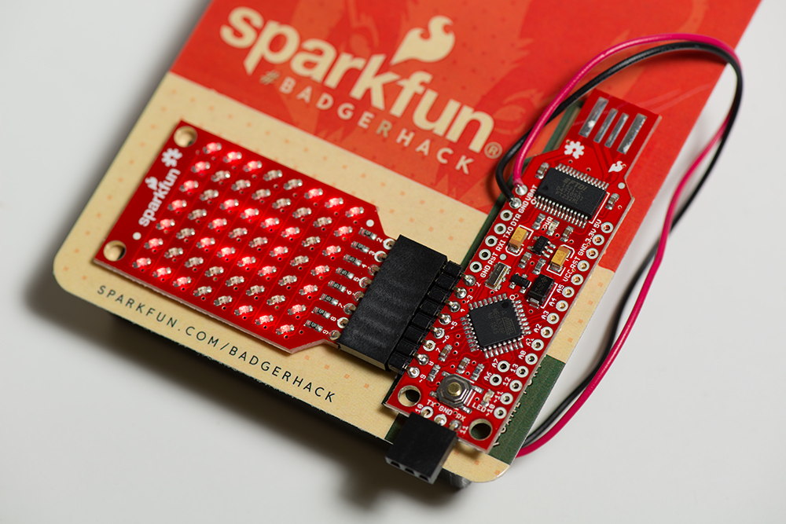
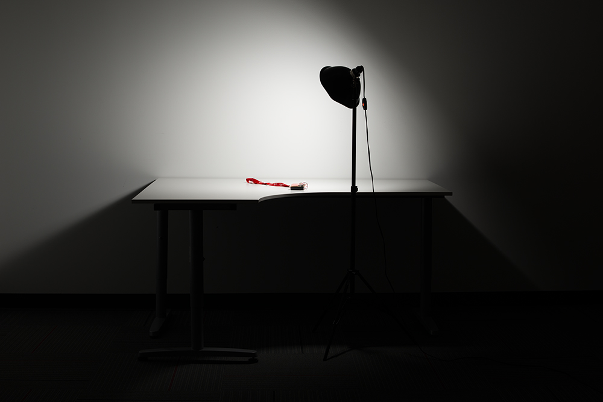
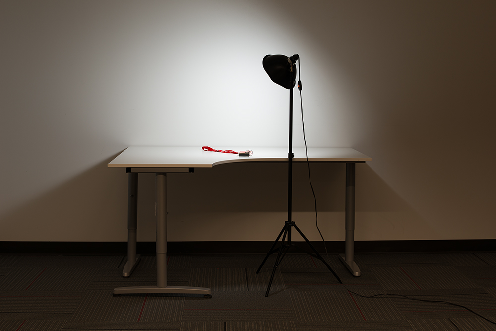

Visual Content
==============

Photographs 
-----------

Photos are the backbone of every tutorial. They help tell a story that words maybe cannot convey. A good tutorial is one that can be viewed by the images alone, and the reader can still have an idea of what's happening. Our photo standards are very high, and we expect the same from outside authors. 

Instructions
------------

Please include three (3) sample photographs to demonstrate that you have the skills and tools necessary to meet these standards. 

1. Project Shot - Single Neutral Light - Tripod

    

 
2. Macro Shot - Single Neutral Light - Tripod

    

3. Larger Project Shot - Single Neutral Light (Ideal) or Multiple Light Sources - Tripod 

    

    
    

Requirements
-------------

* 1000 pixel wide jpeg file format. No more, no less.
* All images are the same size and shape. 
* Clear sharp image is a must.  
* Sunlight on a white blank paper for small parts is an easy way to get a camera to work its auto magic.
* Find an angle to shoot from that prevents flash or sunlight from reflecting directly into the lens.
* Avoid harsh shadows.
* Minimal image noise. Watch that ISO setting.
* Avoid inconsistent cropping, instead stretch the image to fill the frame with your subject.
* Avoid using video frames as still photos. Video and photo images are not the same thing.
* Clear your background of clutter.
* Use a tripod and an extended exposure setting in low light.
* Photographs with blown out highlights will not be accepted. 
* Move around with the camera until you find a pleasing angle of your subject.
* Anchor subject lines to the edge of your frame.
* Avoid over/undersaturated images in post editing.
* Save your files. We may be able to whip them into shape with photoshop if at first they don't succeed.

Additional points
------------------

We highly encourage you to include any other visual content you may have created in the past. This can include 3D Models, Graphic Designs, Fritzing Circuit Diagrams, Schematics, etc. 

* The model/design does not need to be overly complex, if creating one from scratch.
* This must be your original work. Any partial contributions from others should be attributed. 
